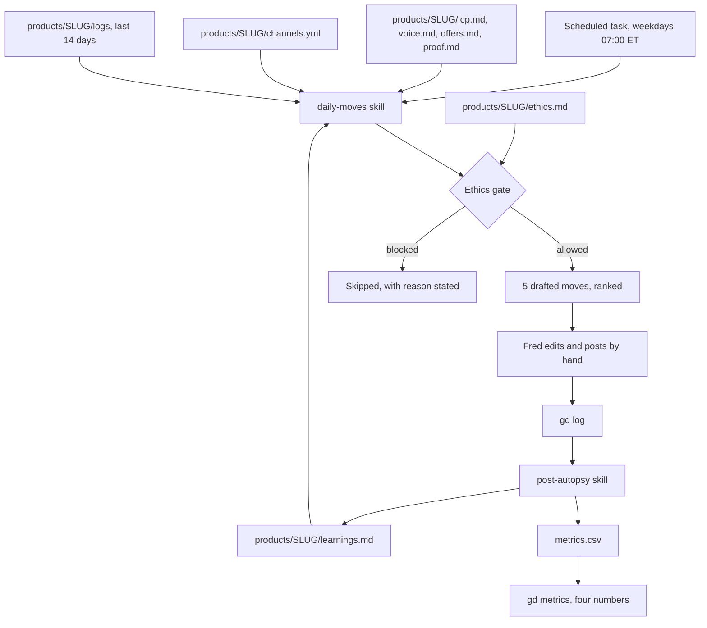

# Growth Desk. Product Requirements Document

**Version** 1.0
**Date** 11 September 2026
**Owner** Fred Twum-Acheampong
**Build target** Claude Code
**Status** Ready to build

---

## Executive Summary

Growth Desk is a local, git-backed growth operating system that replaces subscription tools like HeyCatch ($2,548/year across three products) with a repo of markdown files, five Claude Code skills, and one scheduled task. It produces five drafted, channel-appropriate growth moves every weekday for Marskel, Deckle and Echoself, logs what happened to each one, and compounds those results into a shared learnings library that survives any vendor.

The system never auto-posts. A human presses send every time. That single constraint removes the entire class of platform-ban risk that killed GummySearch and that shadowbans automated posters under Reddit's 2026 enforcement rules.

---

## Problem Statement

### The measured problem

| Fact | Number |
|---|---|
| Products needing distribution in parallel | 3 (Marskel, Deckle, Echoself) |
| HeyCatch cost to cover all three, year one | $2,548.05 |
| HeyCatch billing cycles per year (4-week billing) | 13, not 12 |
| Founder time per post without tooling | ~45 to 60 minutes |
| Founder time per post with drafting assist | ~5 minutes |
| Reddit accounts needed, warmed, before promo | 1 per product, 2 weeks, 100+ karma |

### The four failures Growth Desk exists to fix

1. **No shared memory.** Every good post Fred has written lives in a platform's history, not in a file he owns. Nothing compounds. Cancel a SaaS tool and the learning leaves with it.
2. **One engine, three unrelated buyers.** Marskel sells a $79 to $799/mo AI executive team to technical solo founders. Deckle sells a PDF generation API to backend engineers on a free tier. Echoself sells a $9 to $19/mo voice-legacy product to families with aging or terminally ill relatives. A single generic growth engine pointed at three URLs produces generic copy for all three.
3. **Vanity measurement.** Page views and impressions are the default metric everywhere. They do not predict revenue at this stage. Replies from real humans do.
4. **Unmanaged ethical risk on Echoself.** Echoself's buyers congregate in grief, hospice, caregiver and terminal-illness communities. Most of those communities ban promotion outright, and posting product copy into them is reputationally and morally indefensible. Any tool that treats all three products identically will draft exactly that post and hand it to Fred to send.

### The failure mode that actually kills this project

Not technical. Fred builds it over a weekend, uses it for nine days, and stops. Section 12 treats this as the primary risk, not an afterthought.

---

## Solution Overview

A repo called `growth-desk` holding one folder per product, five Claude Code skills, one small CLI, and a weekday scheduled task.

```
Morning 7am  →  scheduled task fires
             →  daily-moves skill reads the product folder + last 14 days of logs
             →  emits 5 drafted moves, ranked by expected reply rate
             →  ethics gate filters any move touching a denylisted community
             →  Fred reads, edits, posts manually
             →  gd log records the move
             →  post-autopsy writes the outcome and updates learnings.md
             →  next morning's moves are informed by yesterday's result
```

No web app. No database. No auth. No deploy. The stack is a git repo, markdown files, and Claude Code, and that is a deliberate architectural choice defended in Section 6.

---

## Target Users

**Primary user.** Fred, solo, operating three products at once, technical, already building with Claude Code daily, already holding written voice rules and banned-word lists.

**Secondary user.** A future contractor or cofounder who clones the repo and is productive on day one, since the ICP, voice, proof and every past result are checked in as plain text.

**Explicit non-user.** This is not a product for sale. It is internal infrastructure. Any temptation to turn it into a SaaS belongs in a separate document and must not influence scope here.

---

## The Three Products

The whole design rests on these being genuinely different. Getting this table right is the highest-leverage hour of the build.

| | **Marskel** | **Deckle** | **Echoself** |
|---|---|---|---|
| URL | marskel.com | getdeckle.dev | myechoself.com |
| One line | AI executive team for solo founders | HTML in, pixel-perfect PDFs out | Your voice, preserved forever |
| Buyer | Pre-seed to seed technical solo founder | Backend or full-stack engineer | Adult child of an aging parent, or someone with a terminal diagnosis |
| Motion | Sales-assisted, trust-gated | Product-led, free tier of 1,000 PDFs/mo | Consumer, emotionally gated |
| Price | $79 / $319 / $799 per month | Free, then $29/mo for 10,000 PDFs | $9/mo text, $19/mo voice clone |
| Real wedge | Named human reviewers with Red/Yellow/Green autonomy, in a category with a documented trust problem | You are maintaining a headless Chrome in production and you hate it | The recording habit, not the AI. Nobody regrets having the tapes |
| Proof asset | Free SAFE/NDA review tool (Lex) | Free tier, self-hostable Docker, comparison against Puppeteer, wkhtmltopdf, Prince XML | The live demo Echo, playable with no signup |
| Buying trigger | Just got told to hire a fractional exec they cannot afford | Hit a font rendering bug at 2am, or a Lambda timeout on Puppeteer | A diagnosis, a hospital stay, a parent's 80th birthday |
| Time to value | Weeks | Minutes | Months, and that is the core product problem |
| Channel character | Founder communities, warm intros, build-in-public | Technical search, Show HN, framework subreddits, docs quality | Owned, earned and partnership only. See Section 5 |

---

## Section 5. The Channel Ethics Gate

**This is the feature that makes Growth Desk better than anything purchasable, and it is P0.**

Every product folder carries an `ethics.md` with three lists that the `daily-moves` skill reads before it generates anything.

### Gate rules

| Rule | Behavior |
|---|---|
| `never_post` | The skill refuses to generate promotional copy for these communities. It may still read them for research. It states out loud when it skipped a high-value community and why. |
| `no_first_person_promo` | The skill may draft helpful, non-promotional replies with no link and no product name. |
| `open` | Normal promotional drafting allowed, subject to the 90/10 value ratio. |

### Echoself denylist, non-negotiable

`r/GriefSupport`, `r/hospice`, `r/CaregiverSupport`, `r/AgingParents`, `r/cancer`, `r/ALS`, `r/dementia`, `r/widowers`, and any Facebook group whose name contains grief, hospice, palliative, terminal, caregiver or bereave.

Growth Desk will never draft a promotional post into a room where people are processing a death. The correct Echoself growth motion is owned media, earned press, partnerships with estate attorneys, senior living operators and hospice social workers, plus search intent on queries like "record my dad's stories before he dies". All of those are generated. None of them require infiltrating a support group.

### Marskel and Deckle gates

Marskel carries `no_first_person_promo` on `r/startups` and `r/Entrepreneur`, which have aggressive self-promotion rules. Deckle is largely `open`, with `never_post` on Stack Overflow answers, where product links in answers are against policy and will get the account nuked.

---

## Core Features

### Phase 1. Weekend MVP

| Feature | Description | Priority | Complexity |
|---|---|---|---|
| Repo scaffold | `growth-desk` with root `CLAUDE.md`, `products/`, `shared/` | P0 | Low |
| Product folder spec | Eight canonical files per product, schema fixed in Section 7 | P0 | Low |
| Marskel folder, hand-filled | Every field real, no placeholders. Sets the quality bar the other two inherit | P0 | Medium |
| `growth-research` skill | Finds where the buyer already complains, quotes pain phrases verbatim | P0 | Medium |
| `daily-moves` skill | Emits 5 drafted moves with the ethics gate applied | P0 | High |
| `gd` CLI, log and streak | Append a move to today's log, print the streak | P0 | Low |

### Phase 2. Week two

| Feature | Description | Priority | Complexity |
|---|---|---|---|
| `post-autopsy` skill | Records outcome, updates `learnings.md`, retires dead rules | P0 | Medium |
| `landing-audit` skill | Scores a page, returns a prioritized diff, then implements it and opens the PR | P0 | Medium |
| Ethics gate | `ethics.md` per product, enforced inside `daily-moves` | P0 | Medium |
| Scheduled task | Weekdays 07:00 America/New_York, delivers the day's moves | P0 | Low |
| Deckle and Echoself folders | Cloned structure, hand-filled content | P0 | Medium |
| `gd metrics` | Rollup of the four numbers from `metrics.csv` | P1 | Low |

### Phase 3. Weeks three and four

| Feature | Description | Priority | Complexity |
|---|---|---|---|
| `weekly-review` skill | Friday synthesis across all three products, kills what is not working | P1 | Medium |
| Gmail objection mining | Reads real threads, extracts verbatim objections into `proof.md` | P1 | Medium |
| Search Console feed | Pulls striking-distance keywords via the connected SEO server | P1 | Low |
| Clay enrichment | Builds the 50 named humans per product worth a direct message | P2 | Medium |
| Deckle comparison pages | Programmatic pages against Puppeteer, wkhtmltopdf, Prince XML, Gotenberg, DocRaptor | P1 | Medium |
| HeyCatch head-to-head | 30-day controlled test, Deckle on HeyCatch, Marskel on Growth Desk | P2 | Low |

### Explicitly out of scope for v1

Auto-posting of any kind. A web dashboard. Multi-user support. Anything that touches a platform API to write. Selling this to anyone.

---

## Section 6. Technical Architecture

### System overview



### Tech stack

| Layer | Technology | Rationale |
|---|---|---|
| Storage | Plain markdown, YAML and CSV in a git repo | The data is prose that Claude reads and Fred edits. A database would add a query layer neither of them needs and would make every value invisible in a diff. Git gives free history, free branching per experiment, and free portability. |
| Orchestration | Claude Code skills, five of them | Skills are versioned text that live next to the data they read. Fred has already shipped skills, so the pattern carries no learning cost. |
| Parallelism | Claude Code subagents | Research fans out across three products in one call rather than three sessions. |
| Automation | One scheduled task on the remote runner | Produces the streak mechanic that is the real value inside HeyCatch. |
| CLI | Node 20, zero runtime dependencies | Two commands only. A dependency tree would be the heaviest thing in the repo. |
| Data inputs | Gmail, Clay, Google Search Console, all already connected | Drafting from real objections in real threads beats drafting from a scraped landing page. This is the single biggest quality gap over any purchasable tool. |
| Hosting | None | Nothing is served. Nothing is deployed. Nothing can go down. |

### Why not a real app

A Next.js and Postgres version of this would take three weeks, would need auth nobody uses, and would put the ICP behind a form instead of in a diff. The correct architecture for a single-operator tool whose primary consumer is an LLM is a folder of well-structured text. Revisit only if a second full-time operator joins.

---

## Section 7. Data Model

### Repo layout

```
growth-desk/
├── CLAUDE.md                    # operating rules, read on every session
├── README.md
├── bin/
│   └── gd                       # node CLI, executable
├── .claude/
│   └── skills/
│       ├── growth-research/SKILL.md
│       ├── daily-moves/SKILL.md
│       ├── post-autopsy/SKILL.md
│       ├── landing-audit/SKILL.md
│       └── weekly-review/SKILL.md
├── shared/
│   ├── voice-rules.md           # banned words, no em dashes, no colons
│   ├── move-types.md            # the taxonomy in Section 8
│   └── learnings.md             # cross-product patterns only
└── products/
    ├── marskel/
    │   ├── icp.md
    │   ├── voice.md
    │   ├── offers.md
    │   ├── proof.md
    │   ├── channels.yml
    │   ├── ethics.md
    │   ├── learnings.md
    │   ├── metrics.csv
    │   └── logs/
    │       └── 2026-09-15.md
    ├── deckle/                  # same eight files
    └── echoself/                # same eight files
```

### File schemas

**`icp.md`** holds who buys, the trigger event that makes them buy today, what they call the problem in their own words, where they already are, and who they are not. Every claim carries a source tag of `verified`, `assumed` or `dead`. Assumed claims are the test backlog.

**`voice.md`** holds five to ten real sentences Fred has written that sound like the product, plus the banned list, plus register notes by audience.

**`offers.md`** holds every callable ask, ordered by friction. Reply to this comment, try the free demo, book fifteen minutes, start the free tier.

**`proof.md`** holds verbatim quotes, real numbers, named customers and named reviewers. No paraphrase. The rule is that if it cannot be quoted, it is not proof.

**`channels.yml`**

```yaml
channels:
  - id: r/SaaS
    kind: reddit
    gate: open
    subscribers: 380000
    rules_url: https://reddit.com/r/SaaS/about/rules
    promo_policy: "self-promo Saturdays only"
    account: marskel_fred
    karma_required: 100
    cadence_cap_per_week: 2
    pain_phrases:
      - "I can't afford a fractional CMO"
      - "I'm the founder, the sales team and support"
    status: active          # active | warming | burned
    warmed_on: 2026-09-01
```

**`metrics.csv`**

```csv
date,product,channel,move_id,move_type,url,replies,qualified_convos,signups,paid,notes
2026-09-15,marskel,r/SaaS,mk-0142,helpful_reply,https://...,7,2,1,0,"Lex tool link converted"
```

Page views are deliberately absent from this file. Adding a views column is a scope violation.

**`logs/YYYY-MM-DD.md`** holds the five moves generated that day, which ones were sent, the edits Fred made to the draft, and a one-line result. The edit delta is the most valuable field in the system, since it is the training signal for voice.

---

## Section 8. Move Taxonomy

`daily-moves` may only emit moves of these seven types. The constraint stops the skill drifting into generic content-calendar output.

| Type | Definition | Expected reply rate | Typical product |
|---|---|---|---|
| `helpful_reply` | Answer a live question fully, with no link and no product name | High | All three |
| `soft_reply` | Answer fully, then disclose the product in one clause at the end | Medium | Marskel, Deckle |
| `original_post` | A post that stands alone as useful, in a community with an open gate | Medium | Deckle |
| `build_in_public` | A specific number, a shipped thing, or a failure, posted to owned audience | Medium | Marskel |
| `direct_message` | One named human, one specific reason, no template | Highest | Marskel, Echoself partnerships |
| `asset` | Write or fix a page, doc, comparison or free tool | Slow, compounding | Deckle, Marskel |
| `partnership` | Outreach to an organization rather than a person | Low volume, high value | Echoself |

Ranking rule. The skill orders the five moves by expected qualified conversations, not reach. A direct message to one hospice social worker outranks a post that 4,000 people scroll past.

---

## Section 9. The Five Skills

Copy-paste ready. Each goes in `.claude/skills/<name>/SKILL.md`.

### 9.1 growth-research

```markdown
---
name: growth-research
description: Find where a product's buyer already complains, and quote their exact words. Use when setting up a new product folder, when channels go stale, or when asked to find new communities for Marskel, Deckle or Echoself.
---

# growth-research

## Inputs
Read `products/<slug>/icp.md` and `products/<slug>/ethics.md` before searching.

## Procedure
1. Derive 10 search phrases from the ICP's own vocabulary, not marketing vocabulary.
2. Search for communities, threads and accounts where those phrases appear.
3. For each candidate community, record subscriber count, the promotion rule in its own words, and a link to its rules page.
4. Quote at least three pain phrases verbatim per community. Verbatim means copied, not summarized.
5. Apply the ethics gate. A community on the never_post list is still recorded, marked `gate: never_post`, and kept for research value only.
6. Rank by density of the buying trigger, not by subscriber count.

## Output
Append to `products/<slug>/channels.yml` using the schema in the PRD. Never overwrite an existing entry with `status: burned`.

## Hard rules
- Ten communities maximum per run. Fred hand-verifies every one.
- Never invent a subscriber count or a rule. Leave the field blank and flag it.
- Never recommend a community whose rules you could not read.
```

### 9.2 daily-moves

```markdown
---
name: daily-moves
description: Generate five drafted, ranked growth moves for one product for today. Use every weekday morning, or when Fred asks what he should do today for Marskel, Deckle or Echoself.
---

# daily-moves

## Inputs, in this order
1. `shared/voice-rules.md`
2. `products/<slug>/ethics.md`  (read before anything is generated)
3. `products/<slug>/icp.md`, `voice.md`, `offers.md`, `proof.md`
4. `products/<slug>/channels.yml`, filtered to `status: active`
5. `products/<slug>/logs/` last 14 days
6. `products/<slug>/learnings.md`

## Procedure
1. Apply the ethics gate first. Build the allowed channel set. State out loud any high-value channel excluded and the reason.
2. Check cadence caps against the last 14 days of logs. Drop any channel already at its weekly cap.
3. Generate exactly five moves, each from `shared/move-types.md`.
4. Draft the full copy for each move in the product's voice. No placeholders, no "insert stat here".
5. Rank by expected qualified conversations.
6. Give each move an id of `<slug-initials>-<4 digits>`.

## Output format, per move
- Move id, type, channel, and the specific thread or person
- The full draft, ready to paste
- One line on why this move today
- Expected outcome as a number, so it can be scored later

## Hard rules
- Never auto-post. Never call a write API. Output text only.
- Maintain a 90/10 value-to-promotion ratio across any rolling 10 moves.
- Every factual claim in a draft must trace to `proof.md`. No invented metrics.
- Obey `shared/voice-rules.md` absolutely. No em dashes, no colons, no semicolons, no banned words.
- If fewer than five ethical moves exist today, return fewer and say so. Never pad.
```

### 9.3 post-autopsy

```markdown
---
name: post-autopsy
description: Record what happened to a posted move and update the learnings. Use after Fred posts something, or when he pastes a URL and a result.
---

# post-autopsy

## Procedure
1. Take the move id, the live URL, and the observed result.
2. Append a row to `products/<slug>/metrics.csv`.
3. Append the outcome to today's log file, including the delta between the draft and what Fred actually posted.
4. Update `products/<slug>/learnings.md` only when the result confirms or kills an existing rule.
5. A rule with three consecutive failures is moved to a `## Retired` section with the date. Retired rules are never silently deleted.
6. Promote a pattern to `shared/learnings.md` only when it has held on two different products.

## Hard rules
- The draft-versus-posted delta is the highest value field. Always capture it.
- Never record page views.
- Never write a learning from a single data point. Mark it `n=1, unconfirmed`.
```

### 9.4 landing-audit

```markdown
---
name: landing-audit
description: Audit a landing page against the ICP and then implement the fixes. Use when a page is underperforming, before a launch, or when Fred asks for a teardown of marskel.com, getdeckle.dev or myechoself.com.
---

# landing-audit

## Procedure
1. Fetch the page. Read `products/<slug>/icp.md` and `proof.md`.
2. Score against this rubric, 0 to 5 each.
   - Does the headline name the buyer's trigger event
   - Is the wedge visible above the fold
   - Is proof verbatim and attributed
   - Is the lowest-friction offer the most prominent one
   - Does the page answer the top objection from `proof.md`
   - Does the copy obey `shared/voice-rules.md`
3. Return a prioritized diff. Highest revenue impact first.
4. Then implement the copy changes in the product repo and open a pull request. Do not merge.

## Hard rules
- Never change pricing, legal text or claims without explicit approval in the same session.
- Never invent proof to fill a weak section. Flag the gap instead.
- One pull request per audit. Keep it reviewable.
```

### 9.5 weekly-review

```markdown
---
name: weekly-review
description: Friday synthesis across all three products. Use on Fridays, or when Fred asks how the week went across Marskel, Deckle and Echoself.
---

# weekly-review

## Procedure
1. Read `metrics.csv` for all three products, last 7 and last 28 days.
2. Report the four numbers per product. Replies, qualified conversations, attributed signups, paid.
3. Name the single best move of the week and say precisely why it worked.
4. Name the worst channel and recommend burning it or changing the approach.
5. Report the streak. Number of weekdays in the last 14 with at least one move sent.
6. List every `assumed` claim in each `icp.md` that is now testable, with the test.

## Hard rules
- Lead with the number that looks worst. No burying.
- If the streak is under 7 out of 14, say that the system is failing regardless of the other numbers.
```

---

## Section 10. The gd CLI

Two commands in Phase 1, one more in Phase 2. Node 20, no dependencies.

| Command | Behavior |
|---|---|
| `gd log <product> <move-id> --url <url> --replies N --convos N --signups N` | Appends to `metrics.csv` and today's log file |
| `gd streak` | Prints weekdays with at least one sent move, last 14 days, per product |
| `gd metrics [product] [--days 28]` | Prints the four numbers, nothing else |

Acceptance criteria. Running `gd log` twice with the same move id updates the row rather than duplicating it. Running any command in a dirty repo still works. No command ever writes to a platform.

---

## Section 11. Success Metrics

### The only four numbers

| Metric | 30-day target | 90-day target | Measurement |
|---|---|---|---|
| Replies from real humans | 60 across all products | 250 | `metrics.csv` replies column |
| Qualified conversations | 12 | 60 | A conversation where the person states the problem unprompted |
| Attributed signups | 15 | 90 | Source captured at signup, cross-checked against `metrics.csv` |
| Paid conversions | 2 | 12 | Billing system, attributed by source |

### System health metrics

| Metric | Target | Measurement |
|---|---|---|
| Streak | 8 of 10 weekdays in any 2-week window | `gd streak` |
| Draft acceptance | 60% of sent moves posted with under 20% edit | Log delta field |
| Ethics gate violations | Zero, permanently | Manual audit of every Echoself move in week one |
| Accounts burned | Zero | `channels.yml` status field |
| Time from wake to first move sent | Under 15 minutes | Self-reported, weekly |

### The kill criterion

If the streak is under 5 of 10 weekdays at day 30, the habit did not take. Stop building features and either buy HeyCatch or drop organic distribution for a quarter and put the time into product. Honoring this criterion is the point of writing it down now.

---

## Section 12. Risks and Mitigations

| Risk | Impact | Likelihood | Mitigation |
|---|---|---|---|
| **Fred stops using it by week two.** The habit is the product. Every other risk is secondary. | High | **High** | The 7am scheduled task delivers before the day starts. Five moves, not a strategy document. `gd streak` makes the lapse visible. The day-30 kill criterion in Section 11 forces an honest decision rather than a slow fade. |
| Ethics gate ignored under revenue pressure on Echoself | High | Medium | Denylist is checked in, not configurable at runtime. Week one requires manual audit of every Echoself move. Any violation is a stop-the-line event. |
| Reddit account shadowbanned | Medium | Medium | Human send on every move. Two-week warmup with 100+ karma before promo. Cadence cap of 2 per channel per week. 90/10 value ratio enforced in `daily-moves`. Channel marked `burned` on first sign of suppression. |
| Draft copy sounds like AI and damages brand | High | Medium | Every draft is edited by hand before sending. The edit delta feeds back into `voice.md`. Drafts that need over 50% rewrite trigger a `voice.md` update. |
| Invented proof ships in a public post | High | Low | `daily-moves` may only cite `proof.md`. Verbatim-or-nothing rule. Quarterly audit of `proof.md` against source. |
| Three products split attention to zero progress on each | High | High | One product in focus per week, rotating. The scheduled task runs one product per day, not three. |
| Deckle comparison pages read as thin programmatic content | Medium | Medium | Each page needs one real benchmark Fred ran himself. No page ships without an original number. |
| **Total failure case.** Ninety days pass with under 5 paid conversions across all three products. | High | Medium | That is not a tooling failure, it is a wedge failure. The GTM playbook already concluded this once, after the Polsia teardown. Growth came from narrative and building in public, not automated outreach. Response is to fix positioning, starting with leading Marskel on the named human review layer rather than on "AI executive team". |

---

## Section 13. Cost Estimates

### Development

| Phase | Hours | Real cost |
|---|---|---|
| Phase 1, weekend MVP | 10 | One weekend |
| Phase 2, week two | 6 | Evenings |
| Phase 3, weeks three and four | 8 | Evenings |
| **Total** | **24** | **No cash outlay** |

### Operations, monthly

| Service | Cost | Note |
|---|---|---|
| Claude subscription | $0 incremental | Already paid |
| Gmail, Drive, Search Console connectors | $0 | Already connected |
| Clay credits | $0 to 149 | Optional, Phase 3 only |
| Hosting | $0 | Nothing is hosted |
| **Total incremental** | **$0 to $149** | |

### Comparison

| Option | Year one |
|---|---|
| HeyCatch, three products | $2,548.05 |
| Growth Desk | $0 to $1,788, all of it optional Clay credits |
| **Delta at zero Clay spend** | **$2,548 retained** |

---

## Section 14. Timeline

| Slot | Milestone | Deliverable | Done when |
|---|---|---|---|
| Sat AM | Scaffold | Repo, `CLAUDE.md`, `shared/voice-rules.md`, `bin/gd` | `gd streak` runs and prints zeroes |
| Sat PM | Marskel folder | Eight files, hand-filled, zero placeholders | Every `icp.md` claim tagged verified or assumed |
| Sat PM | `growth-research` | Skill written, run on Marskel | 10 communities in `channels.yml`, each hand-verified by opening it |
| Sun AM | `daily-moves` | Skill written, seeded with 10 past posts | First run produces 5 moves Fred would actually send |
| Sun PM | Automation | Scheduled task, weekdays 07:00 ET | A test fire lands in the morning |
| Sun PM | Warmup starts | Three accounts created, warmup begun | Two-week clock started on day one |
| Week 2 Mon | `post-autopsy` | Skill written | First real outcome logged |
| Week 2 Wed | Ethics gate | `ethics.md` for all three, enforced | A deliberate Echoself grief-community prompt is refused |
| Week 2 Thu | Deckle, Echoself folders | Both hand-filled | All three run from the same scheduled task |
| Week 2 Fri | `landing-audit` | Skill written, run on getdeckle.dev | A pull request is open against the Deckle repo |
| Week 3 | `weekly-review`, Gmail mining, Search Console | Skills wired to real data | `proof.md` contains five verbatim objections from real threads |
| Week 4 | Deckle comparison pages, head-to-head starts | Five pages live, HeyCatch trial pointed at Deckle | Both systems logging to the same four metrics |
| Day 30 | Decision | Kill criterion evaluated honestly | Streak reported, keep-or-kill decided |

---

## Section 15. Root CLAUDE.md

This goes in the repo root and is read on every session.

```markdown
# Growth Desk

Internal growth operating system for Marskel, Deckle and Echoself.

## Absolute rules

1. **Never auto-post.** Draft only. A human presses send every time. No write calls to any platform API, ever.
2. **Read `products/<slug>/ethics.md` before generating anything.** The denylist is not advisory.
3. **Every factual claim traces to `proof.md`.** No invented metrics, no rounded-up numbers, no "studies show".
4. **Obey `shared/voice-rules.md`.** No em dashes. No colons. No semicolons. Banned-word list is enforced.
5. **Never record page views.** The four metrics are replies, qualified conversations, attributed signups, paid.
6. **90/10.** Nine value moves for every one promotional move, measured on a rolling ten.
7. **Never pad.** Fewer good moves beats five mediocre ones. Say when you came up short.
8. **Never delete a learning.** Retire it with a date.

## Products
- `marskel` - AI executive team for technical solo founders. marskel.com
- `deckle` - HTML to PDF API for engineers. getdeckle.dev
- `echoself` - Voice legacy product for families. myechoself.com. Highest ethical care.

## Commands
- `gd log <product> <move-id> --url <url> --replies N --convos N --signups N`
- `gd streak`
- `gd metrics [product] [--days 28]`
```

---

## Section 16. Build Commands

```bash
mkdir -p growth-desk/{bin,shared,products/{marskel,deckle,echoself}/logs} \
         growth-desk/.claude/skills/{growth-research,daily-moves,post-autopsy,landing-audit,weekly-review}
cd growth-desk
git init
printf 'date,product,channel,move_id,move_type,url,replies,qualified_convos,signups,paid,notes\n' \
  | tee products/marskel/metrics.csv products/deckle/metrics.csv products/echoself/metrics.csv
chmod +x bin/gd
echo 'export PATH="$PATH:'"$PWD"'/bin"' >> ~/.zshrc
```

Then, in Claude Code, one prompt per skill, pointed at Section 9 of this document.

---

## Section 17. Open Questions

- [ ] Which product gets the focus week first. Deckle has the fastest time to value and the clearest search demand, which argues for starting there rather than Marskel.
- [ ] Does Echoself get organic social at all in v1, or does it run entirely on partnerships and search until the ethics gate has been stress-tested for a month.
- [ ] Are the Reddit accounts per product or one personal account used across all three. Per product is safer and slower.
- [ ] Does Marskel's Lex free tool ship before the growth desk starts pointing traffic at it. Pointing traffic at a missing wedge wastes the warmup.
- [ ] Clay credits in Phase 3, yes or no, given the $0-to-$149 swing is the only real cost in the whole system.
- [ ] Does the head-to-head against HeyCatch happen at all, or is $29.95 and thirty days of attention better spent on the product.

---

## Appendix A. Why not just buy HeyCatch

The honest case for buying. If this ran for one product and stopped, $79.95 a month beats a weekend of founder time, and their support reputation is good. Building wins at three products and a habit that holds. Fred has the three products. The habit is the open question, which is why Section 11 carries a kill criterion.

What HeyCatch structurally cannot do, at any price. It can tell you the landing page is weak. It cannot rewrite it, run the tests and open the pull request. It has no access to Gmail threads, Search Console data, or any of the real conversation history that makes a draft good. And it would cheerfully draft a promotional post into a grief support community, because nothing in its design knows that room exists.

## Appendix B. Sources

- HeyCatch pricing and positioning, heycatch.ai
- Trustpilot, 3.8 from 16 reviews, September 2026
- Reddit automation enforcement changes, March 2026, including the GummySearch shutdown
- Deckle product page, getdeckle.dev
- Echoself product page, myechoself.com
- Marskel product and expert network state, internal
